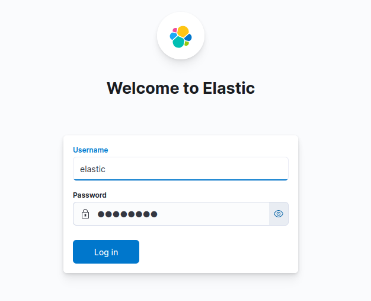
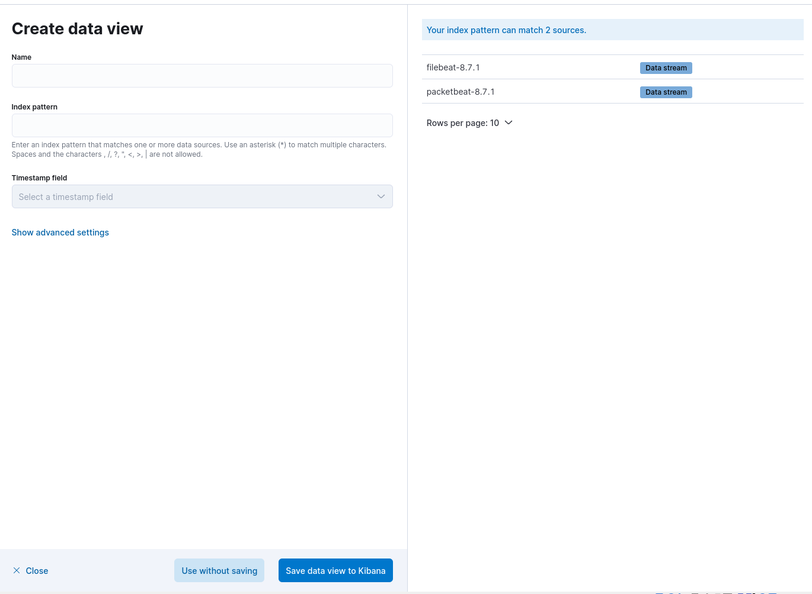
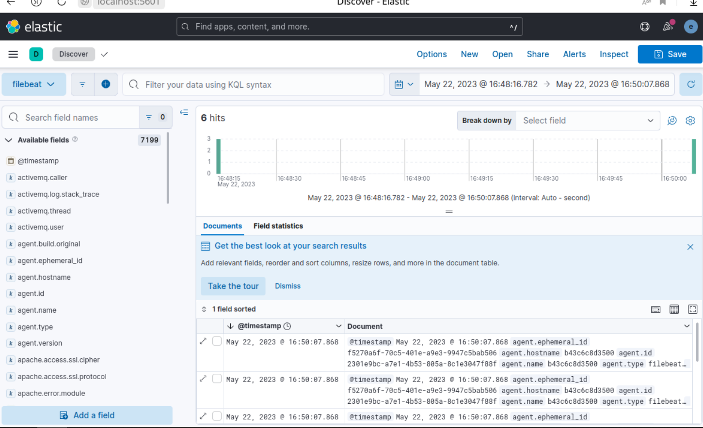
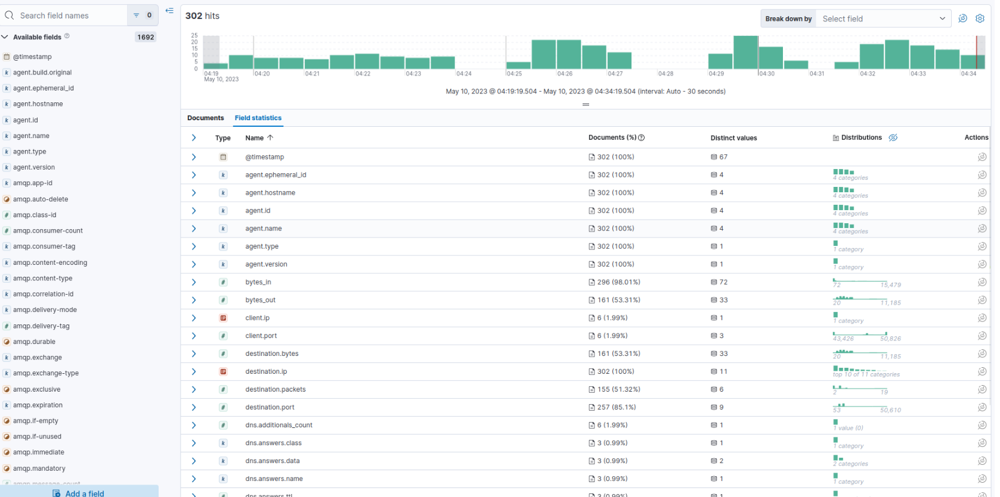

## Цель

1.  Освоить базовые подходы централизованного сбора и накопления информации
2.  Освоить современные инструменты развертывания контейнирозованных приложений
3.  Закрепить знания о современных сетевых протоколах прикладного уровня

## ️Исходные данные

1.  Ноутбук с ОС Windows 10
2.  WSL2 с ОС Ubuntu 22.04
3.  Установленный и настроенный Docker

## Задание

1.  Развернуть систему мониторинга на базе Elasticsearch
    -   Elasticsearch
    -   Beats (Filebeat, Packetbeat)
    -   Elasticsearch Dashboards
2.  Настроить сбор информации о сетевом трафике
3.  Настроить сбор информации из файлов журналов (лог-файлов)
4.  Оформить отчет в соответствии с шаблоном

## Ход выполнения практической работы

Развертывание Elasticsearch осуществлялось с помощью Docker.

### Пункт 1. Развернуть систему мониторинга на базе ElasticSearch

#### Шаг 1. Установка и настройка Elasticsearch и Kibana произведена по информации с сайтов:

https://www.elastic.co/guide/en/elasticsearch/reference/current/docker.html и https://serveradmin.ru/ustanovka-i-nastroyka-elasticsearch-logstash-kibana-elk-stack/

#### Шаг 2. Для работы ElasticSearch требуется увеличить размер виртуальной памяти системы:

    ```
    sudo sysctl -w vm.max_map_count=262144
    ```


#### Шаг 3. В новой директории необходимо создать файл .env для хранения параметров окружения

    ELASTIC_PASSWORD=wK4e3hXlK.9UsN^f - пароль пользователя elastic

    KIBANA_PASSWORD=_ybsyD8ndurXzTknq - пароль пользователя kibana_system

    STACK_VERSION=8.7.1 - версия образов

    CLUSTER_NAME=docker-cluster - имя кластера

    LICENSE=basic - лицензия

    ES_PORT=9200 - порт elasticsearch

    KIBANA_PORT=5601 порт kibana

    MEM_LIMIT=1073741824 - лимит памяти

### Пункт 2. Создание docker-compose.yml

#### Шаг 1. В файле прописываем параметры Elasticsearch, Kibana, Filebeat, Packetbeat, nginx

Настройки файла взяты с официального сайта elasticsearch: https://www.elastic.co/guide/en/elasticsearch/reference/current/docker.html

``` ()
# Password for the 'elastic' user (at least 6 characters)
ELASTIC_PASSWORD=<elastic>

# Password for the 'kibana_system' user (at least 6 characters)
KIBANA_PASSWORD=<kibana_system>

# Version of Elastic products
STACK_VERSION=8.7.1

# Set the cluster name
CLUSTER_NAME=docker-cluster

# Set to 'basic' or 'trial' to automatically start the 30-day trial
LICENSE=basic
#LICENSE=trial

# Port to expose Elasticsearch HTTP API to the host
ES_PORT=9200
#ES_PORT=127.0.0.1:9200

# Port to expose Kibana to the host
KIBANA_PORT=5601
#KIBANA_PORT=80

# Increase or decrease based on the available host memory (in bytes)
MEM_LIMIT=1073741824

# Project namespace (defaults to the current folder name if not set)
#COMPOSE_PROJECT_NAME=myproject
```

### Шаг 3. В нашей директории создаем файлы filebeat.yml и packetbeat.yml

#### Этап 1. Файл конфигурации Filebeat

Взят из репозитория: https://github.com/elastic/beats/blob/main/filebeat/filebeat.yml

``` ()
filebeat.inputs:
- type: filestream
  id: sys-logs
  enabled: true
  paths:
    - /var/log/apt/*

output.elasticsearch:
  hosts: '${ELASTICSEARCH_HOSTS:elasticsearch:9200}'
  username: '${ELASTICSEARCH_USERNAME:}'
  password: '${ELASTICSEARCH_PASSWORD:}'
  ssl:
    certificate_authorities: "/usr/share/elasticsearch/config/certs/ca/ca.crt"
    certificate: "/usr/share/elasticsearch/config/certs/filebeat/filebeat.crt"
    key: "/usr/share/elasticsearch/config/certs/filebeat/filebeat.key"
```

#### Этап 2. Файл конфигурации Packetbeat

Взят с сайта: https://raw.githubusercontent.com/elastic/beats/7.3/deploy/docker/packetbeat.docker.yml

``` ()
packetbeat.interfaces.device: any

packetbeat.flows:
  timeout: 30s
  period: 10s

packetbeat.protocols.dns:
  ports: [53]
  include_authorities: true
  include_additionals: true

packetbeat.protocols.http:
  ports: [80, 5601, 9200, 8080, 8081, 5000, 8002]

packetbeat.protocols.memcache:
  ports: [11211]

packetbeat.protocols.mysql:
  ports: [3306]

packetbeat.protocols.pgsql:
  ports: [5432]

packetbeat.protocols.redis:
  ports: [6379]

packetbeat.protocols.thrift:
  ports: [9090]

packetbeat.protocols.mongodb:
  ports: [27017]

packetbeat.protocols.cassandra:
  ports: [9042]

processors:
- add_cloud_metadata: ~

output.elasticsearch:
  hosts: '${ELASTICSEARCH_HOSTS:elasticsearch:9200}'
  username: '${ELASTICSEARCH_USERNAME:}'
  password: '${ELASTICSEARCH_PASSWORD:}'
  ssl:
    certificate_authorities: "/usr/share/elasticsearch/config/certs/ca/ca.crt"
    certificate: "/usr/share/elasticsearch/config/certs/packetbeat/packetbeat.crt"
    key: "/usr/share/elasticsearch/config/certs/packetbeat/packetbeat.key"
```

### Шаг 4. Запуск docker-compose

``` ()
docker-compose up -d
```

        Starting lab3_setup_1 ... 
        Starting lab3_setup_1 ... done
        Starting lab3_es_1    ... 
        Starting lab3_es_1    ... done
        Starting lab3_kibana_1 ... 
        Starting filebeat      ... 
        Starting packetbeat    ... 
        Starting lab3_kibana_1 ... done
        Starting packetbeat    ... done
        Starting filebeat      ... done

Активные контейнеры:

``` ()
docker ps
```

        CONTAINER ID   IMAGE                      COMMAND                  CREATED         STATUS                                     PORTS                                                 NAMES
        b96b06e0731c   elastic/filebeat:8.7.1     "/usr/bin/tini -- /u…"   3 minutes ago   Up Less than a second                                                                            filebeat
        52a8d599bfc7   elastic/kibana:8.7.1       "/bin/tini -- /usr/l…"   3 minutes ago   Up Less than a second (health: starting)   0.0.0.0:5601->5601/tcp, :::5601->5601/tcp             lab3_kibana_1
        a705591b03d0   elastic/packetbeat:8.7.1   "/usr/bin/tini -- /u…"   3 minutes ago   Up Less than a second                                                                            packetbeat
        4c3d5dbe651b   elasticsearch:8.7.1        "/bin/tini -- /usr/l…"   3 minutes ago   Up 21 seconds (healthy)                    0.0.0.0:9200->9200/tcp, :::9200->9200/tcp, 9300/tcp   lab3_es_1
        77f91b94432f   elasticsearch:8.7.1        "/bin/tini -- /usr/l…"   3 minutes ago   Up 22 seconds (healthy)                    9200/tcp, 9300/tcp                                    lab3_setup_1

### Пункт 5. Elastic

#### Шаг 1. Заходим на localhost:5601 и авторизируемся через пользователя elastic



#### Шаг 2. Проверим работоспособность Filebeat и Packetbeat:

``` ()
GET _cat/indices
```


#### Шаг 3. Перейдём в раздел "Discover" и создадим Data View для систем сбора информации:



#### Шаг 4. Полученная статистика

Packetbeat:



Filebeat:



## Оценка результата

-   Была успешно развёрнута система мониторинга на базе Elasticsearch.

-   Был настроен сбор информации из файлов журналов.

-   Был настроен сбор информации о сетевом трафике.

## Вывод

В результате лабораторной работы была освоена система контейнеризации приложений Docker, работа с Docker-compose и освоена система централизованного сбора и накопления информации ElasticSearch.
