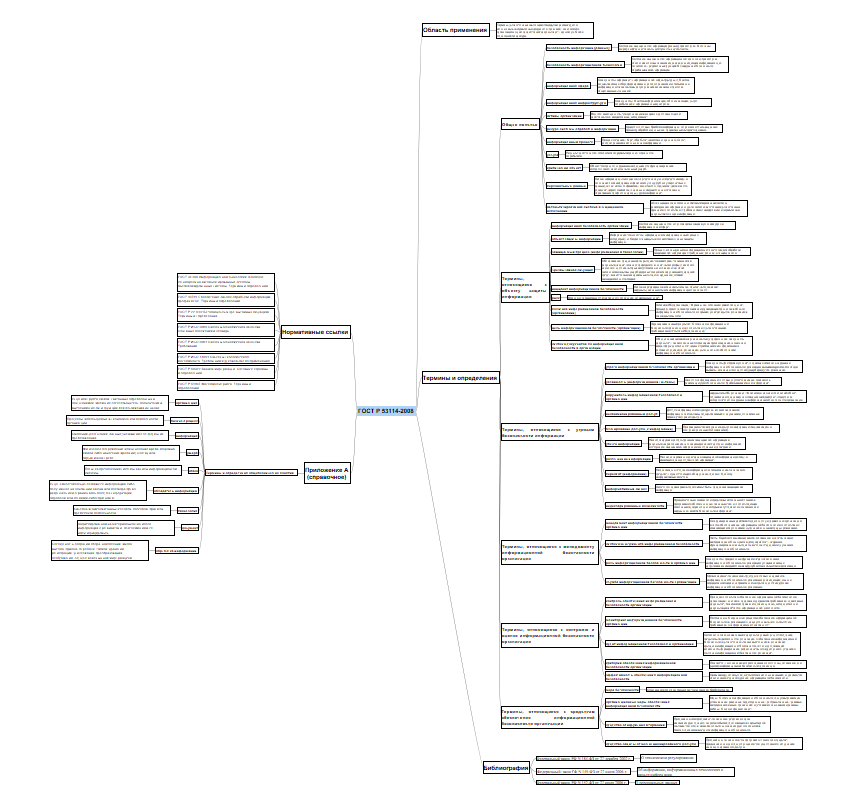

# Практическая работа № 5

## Цель работы

Изучить ГОСТ по защите информации и познакомиться с построением mindmap

### Ход работы

1\. Для построения mindmap был взят ГОСТ Р 53114-2008. Защита информации. Обеспечение информационной безопасности в организации. Основные термины и определения.

Ссылка на документ - https://docs.cntd.ru/document/1200075565

2\. Была использована программа Freeplane

3\. Результат:

{width="845"}

### Оценка результата

В ходе работы был изучен ГОСТ Р 53114-2008. Защита информации. Обеспечение информационной безопасности в организации. Основные термины и определения и была построена mindmap.

### Вывод

Изучена программа Freeplane.
